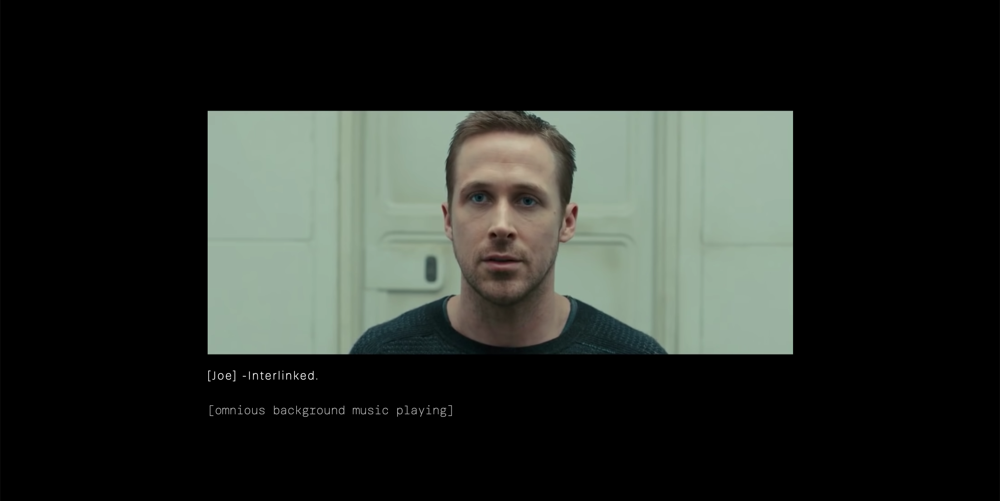

# Web Typography by Jorien Korn
 
Voor dit vak bewerk ik een fragment van de film Blade Runner 2049 op een manier dat de emotie die hoort bij dit fragment voor iemand die doof is nog steeds overkomt. Met de hedendaagse guidelines die gebruikt worden voor closed captioning komt er geen emotie naar voren. Er staat bijvoorbeeld heel statisch '[music is playing]' maar muziek is niet statisch, is het hard? Snel? Luid? Zacht? Rock? Romantisch? Dit verschilt per film en per scene, maar is wel bepalend voor de sfeer van het moment. Voor iemand die niet kan horen gaat al deze informatie verloren. In het fragment van Blade Runner 2049 gaat het precies zo, het eigenlijk een aardig saaie film qua beeld. Het geluid is wat deze scenes spannend maakt, aan mij de opdracht om dit te visualiseren.


# Identiteiten vaststellen
Dit fragment wordt specifiek voor één persoon ontworpen, en dat is Darice de Cuba in mijn geval. In het eerste kennismakingsgesprek heb ik haar een beetje leren kennen zodat ik met haar voorkeuren en inzichten te werk kan gaan en ze kan samenvoegen met de mijne en die van de film. 

## Darice de Cuba
Darice is 38 jaar, woont in Den Haag en werkt als front-end developer. Ze is niet altijd al doof geweest, om deze reden weet ze wel nog hoe sommige geluiden zouden klinken. Ze is bijvoorbeeld erg fan van de TV show Friends en kan hun stemmen nog steeds herinneren. Qua vormgeving is ze de standaard regels gewent voor closed captions, bijvoorbeeld muziek en geluiden tussen brackets plaatsen (met een duidelijke omschrijving van wat!). Persoonlijk vind ze het erg fijn als de vormgeving van elke persoon anders is, dit hoeft niet over-the-top (ze houdt namelijk erg van minimalisme) maar het kan subtiel door alleen de kleur te veranderen bijvoorbeeld. Zolang deze vormgeving maar consistent is. Ook vind ze het fijn als de tekst bijvoorbeeld schuingedrukt komt te staan als de persoon niet in beeld is, dit is namelijk voor iemand die doof is niet te raden en een visuele que hiervoor zou dus ideaal zijn.

## Jorien Korn
Persoonlijk ben ik van een clean, consistente en soms wat minimalistische look. Ik vind snel dingen rommelig of too much en dat probeer ik altijd te voorkomen. Ik doe genoeg om de boodschap, look, feel, etc. over te laten komen maar zonder dat het opdringerig is of in-your-face.

## De film
Ik keek de film pas voor het eerst nadat de opdracht werd gegeven dus ik lette vanaf het begin al erg op de geluiden in de film. Visueel gezien is het niet altijd even spannend, het is een grauwe futuristische film waar ze heel serieus te werk gaan. Gesprekken zijn monotoon, emotieloos en eigenlijk saai. De muziek bij de scenes is wat het spanning en een sfeer geeft.


# Proces

## [Prototype 1](https://jorienkorn.github.io/Web-Typography/closed-captions-v1/index.html)


In het eerste prototype heb ik gebruik gemaakt van het systeemfont om het in eerste instantie uit te proberen of zo de sfeer van de film over komt. Verder heb ik de captions uitgebreid zodat Darice ook weet wanneer er geluid wordt afgespeelt en wie er praat. Alleen van deze ruwe versie kreeg ik al veel feedback punten om mee verder te gaan: 

### Darice
* Er is nog geen onderscheid tussen Joe's binnenstem en stem als hij in beeld is (alles is cursief)
* De groen gebruikt voor "Fuck off, skin job!" was niet goed te lezen
* Ze wilt zoveel mogelijk geluiden (gevisualiseerd) zien zodat ze de hele movie experience krijgt net zoals ons
* Altijd [naam] als iemand aan het woord komt ondanks dat de vormgeving al bekend is

### Vasilis
* Ik mag veel verder gaan dan dit, ook het beeld mag bewerkt en verplaatst worden, niet alleen de typografie/tekst
* Alleen een tag [geluid] brengt het gevoel van de film niet over


## [Prototype 2](https://jorienkorn.github.io/Web-Typography/closed-captions-v2/index.html)


In deze versie heb ik gewerkt aan de punten die ik de vorige keer heb gekregen, ik heb bijvoorbeeld nu alle geluiden gevisualiseerd en ook de vormgeving meer aangepast aan de sfeer van de film. Dit heb ik gedaan door het kleurgebruik en de typografie aan te passen (zie 'Gemaakte keuzes' voor onderbouwing hiervan) en de achtergrond kleur te veranderen.

### Darice
* Vond de geluiden goed visueel uitgewerkt en ondersteunend
* "Fuck off, skin job!" op het scherm leuk, het springt er even tussenuit maar is niet afleidend
* Lettertype mag groter, het is nu erg klein en moeilijk om te lezen
* Heeft behoefte aan zowel de beschrijving van het geluid in brackets als de visuele uitwerking ervan zodat ze weet aan welk geluid ze precies moet denken
* Contrast van de muziek tekst mag wat hoger

### Vasilis
* Vond de uitwerking van de geluiden ook erg leuk


## [Eindversie](https://jorienkorn.github.io/Web-Typography/closed-captions-v3/index.html)


In deze versie heb ik de feedback van vorige keer verwerkt, ik heb bijvoorbeeld het lettertype vergroot zodat het beter leesbaar is. Daarbij heb ik ook meteen het beeld vergroot zodat er nog een goede verhouding is tussen tekst en beeld. Andere dingen die ik heb aangepast zijn:
* Achtergrond geluid in het begin gevisualiseerd
* De tweede scene uitgewerkt
* De plaatsing van de tekst van het geluid op een andere regel gezet. Dit komt nu op zijn eigen regel te staan onder het dialoog, in plaats van op dezelfde hoogte zoals voorheen, omdat soms geluiden door elkaar heen lopen. Op deze manier kan ik zowel dialoog als geluid tegelijk tonen.
* Betere beschrijving van de geluiden
* Andere vormgeving voor de scanner
* Italic voor de binnenstem (gepraat off-screen) gebruikt en Normal als ze in beeld zijn
* Een blur toegevoegd aan het einde van de high pitch zodat je sterker het gevoel krijgt dat het geluid heel hoog is


## [Herkansing](https://jorienkorn.github.io/Web-Typography/closed-captions-v4/index.html)


Tijdens het gesprek voor de eindbeoordeling kwam naar voren dat het fragment qua typografie niet spannend is. "Opvallend onopvallend" noemde Vasilis het. Dit is natuurlijk niet de bedoeling, en heb ik dus besloten om er nog is even goed naar te kijken. Ik ging in eerste instantie alleen voor ```Brenner Mono Light``` voor alle tekst omdat ik dit het beste bij de sfeer en genre van de film vond passen. Hierbij heb ik niet verder nagedacht of dit lettertype ook wel het beste bij de tone-of-voice van de verschillende characters past. In deze versie heb ik dus vooral gefocust op de keuze van de verschillende stijlen van het lettertype, zie hieronder ('Gemaakte keuzes') voor verdere onderbouwing.

* Naast typografie heb ik ook in scene 2 nog een aanpassing gemaakt. Als er op het beeldscherm komt te staan "anomally detected" verkleurt de zwarte achtergrond naar rood in plaats van grijs/groen zoals in het begin. Dit is omdat hij de baseline test gaat falen omdat hij emotie toont, dus vandaar de rode kleur voor gevaar.


# Gemaakte keuzes

## Typografie


Ik heb ervoor gekozen om toch wel gebruik te maken van het Brenner font in plaats van het systeemfont. De film is futuristisch en heeft een onderliggende donkere, monotone toon. Af en toe zit er wel wat emotie in, Brenner geeft hier de mogelijkheid voor om dit uit te drukken dankzij de verschillende stijlen.

### Joe
Voor deze persoon heb ik in scene 1 ```Brenner Mono Light``` en in scene 2 ```Brenner Sans Light``` gebruikt in de kleur wit. In scene 1 gebruik ik de Mono type omdat de baseline test checkt of je emotie hebt, aangezien Joe dat in deze scene niet heeft kies ik voor een emotieloos lettertype. De Mono type is daar goed voor omdat deze vaak wordt gebruikt voor technische/futuristische uitingen zoals code, robots en computers. In scene 2 begint Joe wel vertoningen van emotie te laten zien en kies ik dus voor een neutraal lettertype. De kleur wit heb ik voor hem gekozen omdat hij de hoofdpersoon is en dus het meeste aan het woord is, het is fijn als hij een standaard kleur heeft zodat het goed afwisselt met een andere stem die in kleur voorkomt.

### Male interviewer
Voor deze stem heb ik ```Brenner Regular Light``` gebruikt in de kleur geel. De stem behoort toe aan een robot, de robot praat op een monotone manier zonder enige emotie. Vandaar dat ik voor hem het Mono type heb gekozen, om dezelfde reden als die bij Joe genoemd is. Voor hem heb ik het in Regular gedaan in plaats van Light omdat de robot intimiderender is dan Joe, dit komt omdat hij een test aflegt aan Joe. De kleur geel heb ik voor hem gedaan omdat dit naast wit het meest gebruikt wordt voor ondertiteling. Ook past de kleur daarbij in het kleurenpallet van de film.

### Stranger
Voor deze persoon heb ik ```Brenner Sans Bold``` gebruikt in de kleur rood. Ik heb voor hem Sans Bold gekozen omdat hij Joe uitscheldt op een agressieve, verwijtende manier. Omdat hij emotie toont krijgt hij dus geen Mono type, maar een neutraal lettertype. Dit is voor hem in de kleur rood omdat dit past bij de boosheid die hij uitstraalt in die zin en in bold vanwege zijn toon en agressie.

### Male voice
Voor deze persoon heb ik ```Brenner Sans Light``` gebruikt in de kleur oranje. Er is niet veel over hem bekend aangezien we hem niet zien, maar wel is de manier te horen hoe hij 'Constant K' zegt. Hij zegt dit op een soort van luchtige manier, dus kan ik ervan uitgaan dat hij niet zo emotieloos is zoals de robot. Vandaar dus de keuze voor Brenner Sans, een neutraal lettertype. In de kleur oranje omdat dit goed leesbaar is en past bij de rest van de kleuren.

### Muziek
Voor de muziek heb ik ```Brenner Mono Light``` gebruikt in de kleur licht grijs. Dit heb ik gedaan omdat de muziek de identiteit van de film weergeeft, deze is grauw en duister. De muziek is onheilspellend en de geluiden lijken te komen van machines, om deze reden kies ik ervoor om de muziek ook te weergeven in Mono type. De kleur die ik daarvoor heb gebruikt is licht grijs omdat het niet moet vloeken met de kleuren van de characters en het moet ook niet de aandacht van het dialoog wegnemen.

## Kleur en vlakverdeling


Eigenlijk heb ik de kleuren hierboven al behandeld per individu, maar hier zal ik nog wat meer ingaan op de algemene gedachte en keuze erachter. Ik had in eerste instantie opgezocht welke kleuren vaak gebruikt worden voor ondertiteling en daarbij andere felle kleuren gezocht voor de rest van de stemmen zodat het aansluit op Darice haar behoefte voor neon kleuren. Na nog een keer goed te hebben gekeken, heb ik doffe kleuren gekozen zodat dit ook aansluit bij het gevoel van de film, de film is namelijk erg grauw en serieus. Ondanks dat Darice neon kleuren erg leuk vind heb ik toch besloten om hiervoor te gaan. Ik neem op deze manier wel van haar mee dat ze verschillende kleuren fijn vind, alleen pas ik aan hoe fel deze zijn en in welke tonen ze komen zodat het aansluit op de identiteit van de film.

Ik heb ervoor gekozen om het beeld in het midden te zetten zodat er een goede verhouding is tussen links en rechts. Soms komt een geluid van links en daarna van rechts, op deze manier heb ik aan beide kanten genoeg ruimte om de visualisaties te laten zien.


# Exclusive Design Principles

## Study situation
Ik ken niemand die doof is maar ben er wel al een paar jaar bewust van dat het hier en daar een hindernis kan zijn, ik probeer daarom bij YouTube videos closed captions te voorzien. Qua vormgeving daarvan op het niveau wat we nu doen weet ik eigenlijk niks van, daarom heb ik eerst wat artikelen gelezen (zie 'Bronnen' onderaan) over regels voor ondertiteling en specifiek voor dove mensen zodat ik meer te weten kwam over hoe dit te werk gaat en toegepast wordt. Wel vond ik het lastig om informatie te vinden over hoe je geluiden kan visualiseren voor dove mensen, dit is iets wat ik zelf heb moeten ervaren en uitvinden tijdens de feedbackgesprekken met Darice.

Ook om een beter beeld te krijgen van de .. het fragment, heb ik de gehele film bekeken. Door de hele film te kijken kon ik begrijpen waar de baseline test over gaat en wat het inhoudt. Deze informatie kon ik gebruiken om het gevoel visueel te vertalen voor Darice.

## Ignore conventions
Het "normale" om te doen bij een film die voor dove mensen toegankelijk moet zijn is closed captions toevoegen en that's it. Met deze opdracht ging ik veel verder dan dat. In de ruimte om het fragment heen verschijnen kleuren en gradients in bepaalde vormen om geluiden visueel uit te beelden. Op een moment begint het beeld zelfs met schudden. Dit is niet iets wat je standaard ziet bij een film, maar wel wat nodig is om de doelgroep die doof is een bepaalde sfeer van de scene en geluiden mee te geven. Ook is de tekst normaal standaard maar één kleur, in deze uitwerking heeft elke character zijn eigen kleur en eigen stijl van het Brenner font.


# Bronnen
* [Exclusive Design Principles](https://exclusive-design.vasilis.nl)
* [Captions: Sound Effects and Music](https://www.captioningkey.org/sound_effects.html)
* [Closed Captioning](https://www.3playmedia.com/resources/popular-topics/closed-captioning/)
* [Subtitle Design](https://blog.prototypr.io/subtitles-were-never-designed-the-missing-element-in-tv-typography-design-4277d777548d)
* [Subtitles VS Closed Captions](https://www.rev.com/blog/subtitles-vs-captions)
* [Inclusive Design](https://www.youtube.com/watch?v=M0cR_HTeWUo)
* [CSS gradients](https://cssgradient.io)