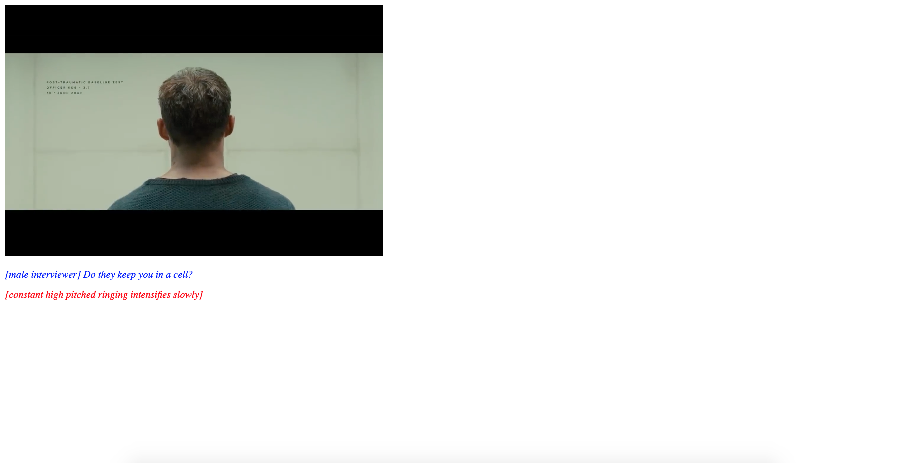

# Web Typography by Jorien Korn
 
Voor dit vak bewerk ik een fragment van de film Blade Runner 2049 op een manier dat de emotie die hoort bij dit fragment voor iemand die doof is nog steeds overkomt. Met de hedendaagse guidelines die gebruikt worden voor closed captioning komt er geen emotie naar voren. Er staat bijvoorbeeld heel statisch '[music is playing]' maar muziek is niet statisch, is het hard? snel? luid? zacht? rock? romantisch? Dit verschilt per film, per scene. Voor iemand die niet kan horen gaat al deze informatie verloren. In het fragment van Blade Runner gaat het precies zo, het eigenlijk een hele saaie film qua beeld. Het geluid is wat deze scenes spannend maakt, aan mij de opdracht om dit te visualiseren.

# Concept
Dit fragment wordt specifiek voor één persoon ontworpen, en dat is Darice de Cuba in mijn geval. In het eerste kennismakingsgesprek heb ik haar een beetje leren kennen zodat ik met haar voorkeuren en inzichten te werk kan gaan en ze kan samenvoegen met de mijne en die van de film. 

## Darice de Cuba
Darice is 38 jaar, woont in Den Haag en werkt als front-end developer. Ze is niet altijd al doof geweest, om deze reden weet ze wel nog hoe sommige geluiden zouden klinken. Ze is bijvoorbeeld erg fan van de TV show Friends en kan hun stemmen nog steeds herinneren. Qua vormgeving is ze de standaard regels gewent voor closed captions, bijvoorbeeld muziek en geluiden tussen brackets plaatsen (met een duidelijke omschrijving van wat!). Persoonlijk vind ze het erg fijn als de vormgeving van elke persoon anders is, dit hoeft niet over-the-top (ze houdt namelijk erg van minimalisme) maar het kan subtiel door alleen de kleur te veranderen bijvoorbeeld. Zolang deze vormgeving maar consistent is. Ook vind ze het fijn als de tekst bijvoorbeeld schuingedrukt komt te staan als de persoon niet in beeld is, dit is namelijk voor iemand die doof is niet te raden en een visuele que hiervoor zou dus ideaal zijn.

## Jorien Korn (me)
Persoonlijk ben ik van een clean, consistente en soms wat minimalistische look. Ik vind snel dingen rommelig of too much en dat probeer ik altijd te voorkomen. Ik doe genoeg om de boodschap, look, feel, wat dan ook over te laten komen maar zonder dat het opdringerig is of in-your-face.

## De film
Ik keek de film pas nadat de opdracht werd gegeven dus ik lette vanaf het begin al erg op de geluiden in de film. Visueel gezien is het niet altijd even spannend, het is een futuristische film waar ze heel serieus te werk gaan. Gesprekken zijn monotoon, emotieloos en eigenlijk saai. De muziek bij de scenes is wat het spanning en een sfeer geeft.

## Conclusie
Voor het concept denk ik dat de indentiteiten van alle drie de partijen op de meeste vlakken overeen komt waardoor er een sterke consistente vormgeving kan ontstaan.

# Proces

## [Prototype 1](https://jorienkorn.github.io/Web-Typography/closed-captions-v1/index.html)

In het eerste prototype heb ik gebruik gemaakt van het systeemfont om het in eerste instantie uit te proberen of zo de sfeer van de film over komt. Verder heb ik de captions uitgebreid zodat Darice ook weet wanneer er geluid wordt afgespeelt en wie er praat. Alleen van deze ruwe versie kreeg ik al veel feedback punten om mee verder te gaan: 

### Darice
* Joe's binnenstem visualiseren
* De groen gebruikt voor "Fuck off, skin job!" was niet goed te lezen
* Ze wilt zoveel mogelijk geluiden (gevisualiseerd) zien zodat ze de hele movie experience krijgt net zoals ons
* Altijd [naam] als iemand aan het woord komt ondanks dat de vormgeving al bekend is

### Vasilis
* Ik mag veel verder gaan dan dit, ook het beeld mag bewerkt en verplaatst worden, niet alleen de typografie/tekst
* Alleen een tag [geluid] brengt het gevoel van de film niet over

## [Prototype 2](https://jorienkorn.github.io/Web-Typography/closed-captions-v2/index.html)

In deze versie heb ik gewerkt aan de punten die ik de vorige keer heb gekregen, ik heb bijvoorbeeld nu alle geluiden gevisualiseerd en ook de vormgeving meer aangepast aan de sfeer van de film. Dit heb ik gedaan door het kleurgebruik, de typografie aan te passen (zie 'Gemaakte keuzes' voor onderbouwing hiervan) en de achtergrond kleur te veranderen.

### Darice
* Vond de geluiden goed visueel uitgewerkt en ondersteunend
* "Fuck off, skin job!" op het scherm leuk, het springt er even tussenuit maar is niet afleidend
* Lettertype mag groter, het is nu erg klein en moeilijk om te lezen
* Heeft behoefte aan zowel de beschrijving van het geluid in brackets als de visuele uitwerking ervan zodat ze weet aan welk geluid ze precies moet denken

### Vasilis
* Wilt graag screenshots in de read.me zien voor de onderbouwingen
* Vond de uitwerking van de geluiden ook erg leuk

## [Eindversie](https://jorienkorn.github.io/Web-Typography/closed-captions-v3/index.html)

In deze versie heb ik de feedback van vorige keer verwerkt en de scenes verder uitgewerkt. Ik heb bijvoorbeeld ook het achtergrond geluid in het begin gevisualiseerd en het geluid in de tweede scene.

# Gemaakte keuzes

## Typografie

Ik heb ervoor gekozen om toch wel gebruik te maken van het Brenner font, specifiek de 'Mono' type, omdat ik dit beter bij de film vind passen. De film is futuristisch en in het fragment wordt Joe ondervraagt door een robot. Er is een lack aan emotie en daar vind ik het lettertype erg goed voor.

## Kleur en vlakverdeling
Ook heb ik nog goed gekeken naar het kleurgebruik. Ik had in eerste instantie opgezocht welke kleuren vaak gebruikt worden voor ondertiteling en daarbij andere felle kleuren gezocht voor de rest van de stemmen. Na nog een keer goed te hebben gekeken heb ik doffe kleuren gekozen zodat dit ook aansluit bij het gevoel van de film.

# Exclusive Design Principles

## Study situation
Ik ken niemand die doof is maar ben er wel al een paar jaar bewust van dat het hier en daar een hindernis kan zijn. Ik heb daarom weleens geprobeerd om basic gebarentaal te leren (just in case) en bij YouTube videos closed captions te voorzien. Qua vormgeving op het niveau wat we nu doen weet ik eigenlijk niks van, daarom heb ik eerst wat artikelen gelezen (zie bronnen) over regels voor ondertiteling en specifiek voor dove mensen zodat ik meer te weten kom over hoe dit te werk gaat. Wel vond ik het lastig om informatie te vinden over hoe je geluiden kan visualiseren voor dove mensen, dit is iets wat ik zelf heb moeten ervaren en uitvinden tijdens de feedbackgesprekken met Darice.

## Ignore conventions
Het "normale" om te doen bij een film die voor dove mensen toegankelijk moet zijn is closed captions toevoegen en that's it. Met deze opdracht ging ik veel verder dan dat. Er verschijnen kleuren en gradients in bepaalde vormen om geluiden visueel uit te beelden in de ruimte om de film heen en het beeld begint zelfs met schudden op een gegeven moment. Dit is niet iets wat je standaard ziet bij een film, maar wel wat nodig is om de doelgroep die doof is een bepaalde sfeer mee te geven.

## Prioritise identity
Darice staat voorop omdat zij degene is die mijn ontwerp ervaart, zij is degene die een fijne en versterkte ervaring moet krijgen van deze scenes. Wat zij wilde heb ik, als visual designer, kunnen vertalen naar de praktijk. In combinatie met mijn kennis en eigen identiteit heb ik veel keuzes en feedback kunnen nemen van Darice en die kunnen vertalen.

## Add nonsense
Een lastige voor mij, maar toch heb ik me laten mee gaan hierin. Ik vond het heel raar om dingen om het beeld heen toe te voegen, dat hoort toch namelijk niet? Maar toch heb ik gradients in de vorm van een scanner toegevoegd, of een schuddend beeld, of een achtergrond die van kleur verandert gebaseerd op de muziek.

# Sources
* [Exclusive Design Principles](https://exclusive-design.vasilis.nl)
* [Captions: Sound Effects and Music](https://www.captioningkey.org/sound_effects.html)
* [Closed Captioning](https://www.3playmedia.com/resources/popular-topics/closed-captioning/)
* [Subtitle Design](https://blog.prototypr.io/subtitles-were-never-designed-the-missing-element-in-tv-typography-design-4277d777548d)
* [Subtitles VS Closed Captions](https://www.rev.com/blog/subtitles-vs-captions)